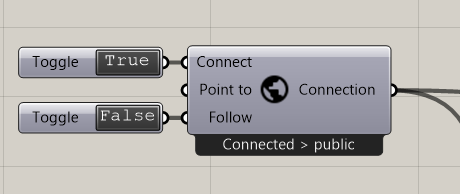

.. ------Header
    _ Hyperlinks that are written xxxxx_ are collected in the conf.py so they can be modified at any time more easily.

.. |RadiiLogo| image:: ../Radii_Icons/Radii_logo.png
    :height: 50

.. ----------------- IMPORTANT: OUT OF DATE AND ON THE EXCLUSION LIST IN CONF.PY  ----------------------------------------------

************************************
Basics & Exploration tutorial old
************************************

Length: ca. 20 min

This tutorial, is based on the Setup_ guide.

It will introduce the basics of the Radii Viewer and the Radii Grasshopper plugin.
Afterward you will be able to explore a model with Radii and you send(upload) geometry.

======================
Radii Viewer
======================

|RadiiLogo|

**Keyboard Assignments**

=========== ===================================
Movement    W,A,S,D
Jump        Space
Shift       Sprint
Q Fly       Up
E Fly       Down
Right Mouse Main Menus (open,close)
Left Mouse  `Operation Menu`_ 
=========== ===================================

**1. Open the `Radii Viewer`_** 

Now you should have an empty scene in front of you, looking like this:

.. image:: /tutorial/Viewer_PC/images/01_Start_image.png

**2. Open Viewer Main Menu**

Right-click to open & close the `Connect Menu`_ that appears on the right side of the window. The + and - at the top let you change the size of the menu.

.. image:: /tutorial/Viewer_PC/images/02_Menue.png

**3. Connect to channel**

.. image::  /tutorial/Viewer_PC/images/02_Menu_zuschnitt.png

Connect to your channel as explained in the `Connect Menu`_ 3. Connect to channel

Note: If you type in a channel name that does not exist so far it is generated and you will be able to connect nonetheless, this means that in case of a typo you will not be notified that something is wrong with your channel name.
In the case that you are not able to receive any geometry, triple check that you have the right address.

**Congratulation** 

You are now connected to a channel and can use the Radii viewer.

.. ---------------------------------------------------------

====================
Radii Grasshopper 
====================

This is a quick introduction into publishing/uploading your files to RADii.
While it is possible to publish in the public channel without an account on RADii.info we advice to make one if you want to have your personal space.
You can do substantially more with the tool as you will find in more detail on the `Radii Viewer`_ and RadiiGrasshopper_ documentation

*The following tool will Publish/Upload all the Geometry in your rhino file. Use it with care and not with big models.*

**1. How to build a basic file to publish**

.. image:: ../Quick_Guide/1_LV_Explo_Images/Grasshopper/01_Quick_Guide_Publisher.png

Every RadiiGrasshopper_ file starts with the Connect_ component it always comes with a boolean (True/False) and the actual 
component. Every component that is intended for publication(sending) will have to be connected to this first one via the connect in- and Output.

Second comes the PublishGeometry_ component that is connected to the Connect_. It needs a geometry input of any kind,
in our case we use a geometry pipeline. Make sure to activate the two icons on the right as shown in the example picture, they should be in color.

Third is PublishMaterial_ , add it to the file and connect it to Connect_ . It will include possible textures of your model. 

**2. Enter Credentials**

Right click on the Connect component and log in with your Radii.info account and password you have created during the setup_ on Radii.info,
left click on "load account" to log in.
Your private domain will show up under - CHANNEL - and possibly others if you are part of a class or group, we have blanked out our group name in the example image.

.. image:: ../Quick_Guide/1_LV_Explo_Images/Grashopper/02_Quick_Guide_Publisher.png

**3. Choose domain and channel**

Right click on the Connect component, there should be a tick next to "username >  My Domain", in this state your would publish your geometry on on your personal channel.

If you want to publish on your groups channel, change the tick to its respective name, in this example that could be sun and should show up as  " sun > My Domain" 
Press Enter to confirm.

More information about channel addresses under Connect_.

*IMPORTANT*: you have to publish to the same channel that you are connected with in the viewer - typos leave you stranded.
If you save your grasshopper file, it will remember your login settings and channel. The viewer will also remember the channel that it was connected to.

.. image:: ../Quick_Guide/1_LV_Explo_Images/Grashopper/03_Quick_Guide_Publisher_zugeschnitten.png

**4. Connect**

To activate the connection to the channel double click on the dark "false" on the Boolean Toggle to turn it into true.

**Congratulations, your model should now appear in your Radii viewer!**