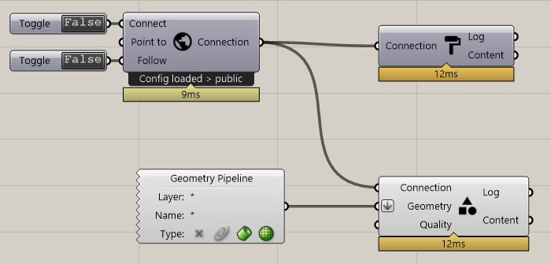
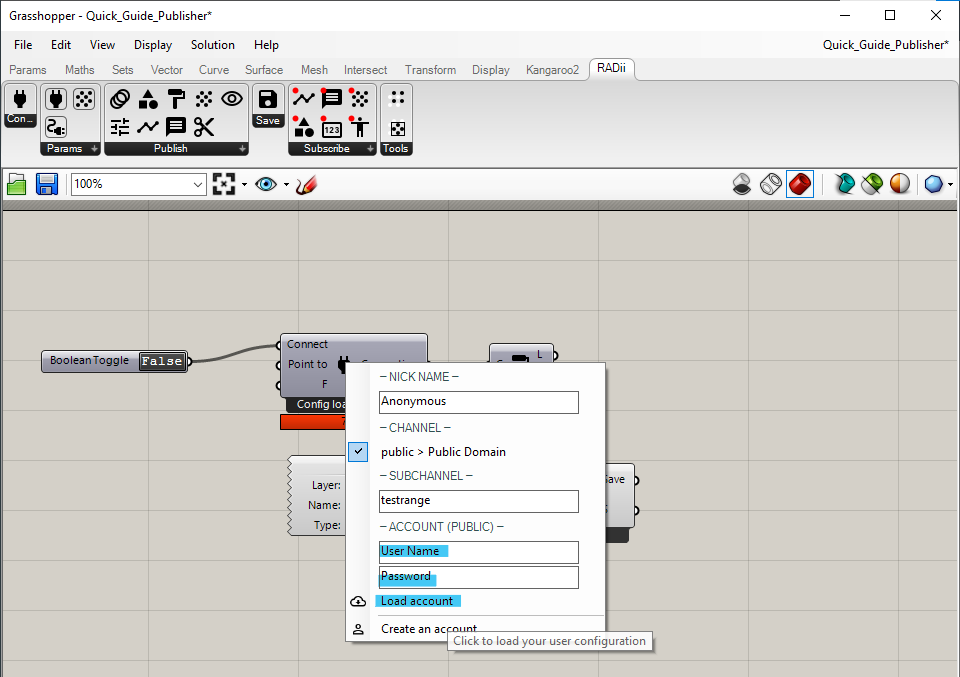
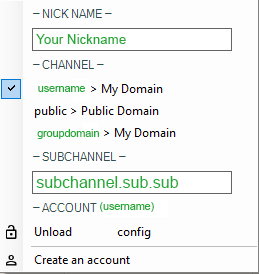
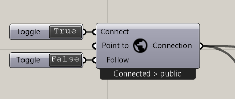

.. ------Header
    _ Hyperlinks that are written xxxxx_ are collected in the conf.py so they can be modified at any time more easily.

.. |RadiiLogo| image:: ../Radii_Icons/Radii_logo.png
    :height: 50

************************************
Tutorial: Publishing Basics
************************************

Length: ca. 10 min

.. topic:: What this is about

  This tutorial will introduce you to the basics of the RADii Grasshopper plugin.
  You will learn, how to publish(upload) geometry to a specific RADii channel. To install your plugin, checkout the `Grasshopper Setup`_ guide.

.. attention:: 

    This setup will publish/upload all existing geometry from your Rhino file. Do not use with big models.

Connect RADii Grasshopper Components
--------------------------------------------

| 
| Every RadiiGrasshopper_ file starts with the Connect_ component. To it, you connect the PublishMaterial_ |PublishMaterial_icon| and the PublishGeometry_ |PublishGeometry_icon|, components.Add a ``geometry input`` to the later, in our example we are using the ``geometry pipeline`` as shown in the picture.

More detail about the components can be found at RadiiGrasshopper_ in the documentation.

.. |Connect| image:: /tutorial/Radii_Icons/ConnectParam.png
.. |PublishMaterial_icon| image:: /tutorial/Radii_Icons/Material.png
.. |PublishGeometry_icon| image:: /tutorial/Radii_Icons/Mesh.png

.. tip:: 

    Geometry pipeline layer control:
    
    - Default
    - Default::SubLayer1
    - Default::SubLayer1::SubLayer2

    Filters:

    - Default (the first layer only)
    - Default* (all layers)
    - Default::* (sublayers only)
    - SubLayer2 (third sublayer only)

Enter Credentials
-----------------------

| 
Log in with your `Radii.info`_ account and password you have created during the `Grasshopper Setup`_ and left click on ``load account`` to log in.
Your private domain will show up under the section ``- CHANNEL -`` and possibly others if you are part of a class or group.

Choose domain and channel
-------------------------------

|
Right click on the Connect component, there should be a tick next to ``username >  My Domain``, in this state your would publish your geometry on on your personal channel.
More information about channel addresses can be found at Connect_.
Change the tick to its respective Domain name.
Press ``Enter`` to confirm.

.. attention::
    Make sure to publish to the same channel that your viewer is connected to - typos leave you stranded.

Connect
---------------

| To activate the connection to the channel ``double click`` 
| on the dark ``false`` on the ``Boolean Toggle`` to turn it into ``true``, as shown in the picture above.

**Congratulations, your model should now appear in your Radii viewer!**

If not start by checking for typos and if the viewer is actually connected to the channel.

Video Tutorial
-----------------

.. youtube:: Ei0d5AoilnU
  :width: 100%
  :align: left

.. - ``Log:`` helps to identify how much and what kind of data is sent
.. - ``Content`` is RADii data that can be used in other components, mainly for storing or collecting. The components are called `Save Scenario`_ and `Save Content`_.

