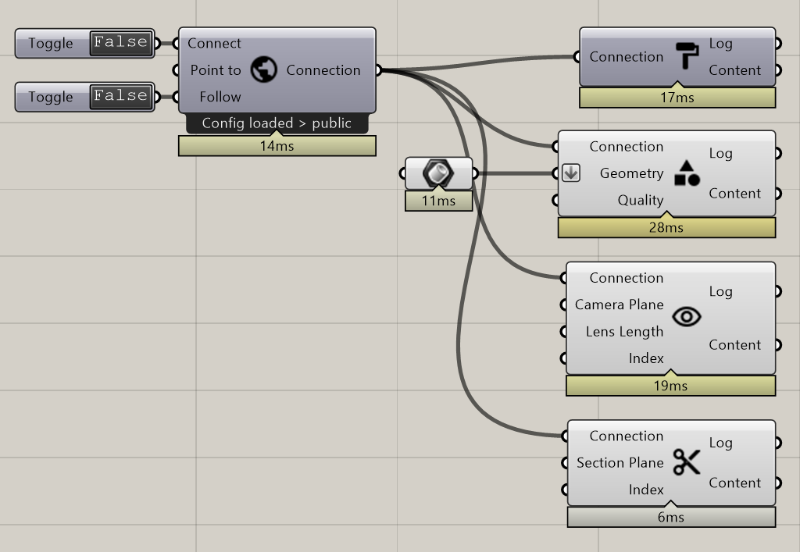

**********************************
Tutorial: Simple Presentation
**********************************

This tutorial is based on the fundamentals in the `Tutorial Grasshopper Basics`_ .

.. topic:: What this is about
  
  This tutorial will introduce you to the main RADii Grasshopper components that are needed for a simple presentation in RADii. 

After publishing the necessary content, there is a number of ways to lead the Viewers through the model. 
First with the ``follow`` option of the `Connect`_ component. After giving a true input, all viewers will follow your active Rhino viewport camera. 
To present specific views use the `Publish View`_ component and the `Publish Section`_ for sections through the geometry. More information can be found in the corresponding entries.  

Component list 
---------------

to be linked to the `Connect`_ component:

- PublishGeometry_
- PublishMaterial_
- `Publish View`_
- `Publish Section`_

For further information, please consult the corresponding entries.

.. tip::

  In the cases of very big models it is the best practice to save them to the cloud before a presentation and then commanding a load to the viewers through the `Publish Reference`_ component.

