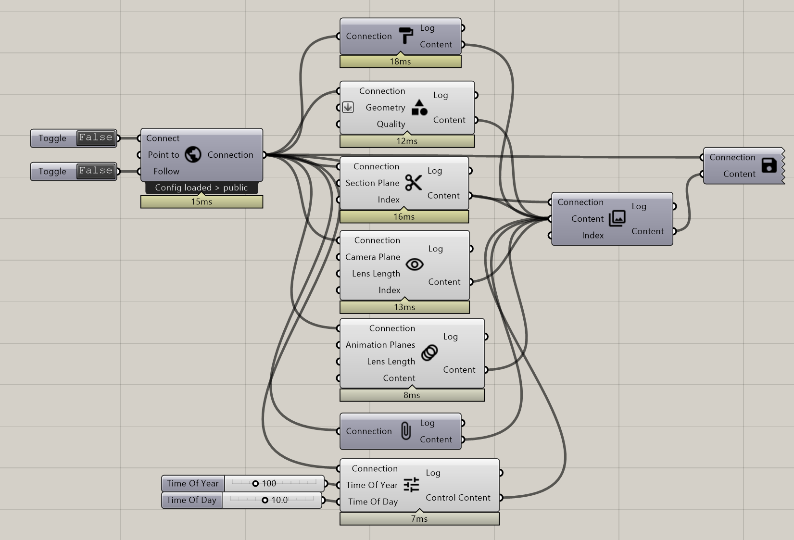

**********************************
Tutorial: Advanced Presentation
**********************************

This tutorial will show how to create a more advanced presentation with the `Publish Animation`_ and `Publish Control`_ components.
With `Publish Animation`_ it is possible to send viewers on defined paths and with, `Publish Control`_ lets you control the display settings of all viewers 
as well as the weather. With the scenario manager you can save a series of settings and switch through them.

- ``Log:`` helps to identify how much and what kind of data is sent
- ``Content`` is RADii data that can be used in other components, mainly for storing or collecting. The components are called `Publish Scenario`_ and `Save Content`_.

Component list 
-------------------------

to be linked to the `Connect`_ component:

- PublishGeometry_
- PublishMaterial_
- `Publish View`_
- `Publish Section`_
- `Publish Animation`_
- `Publish Control`_

Video Examples:
---------------------

- `Animation from 7 simple planes <https://www.youtube.com/shorts/9h1RwmqvWDQ>`_
- `Publish Control <https://www.youtube.com/watch?v=U9Uv8wFHlSQ>`_

