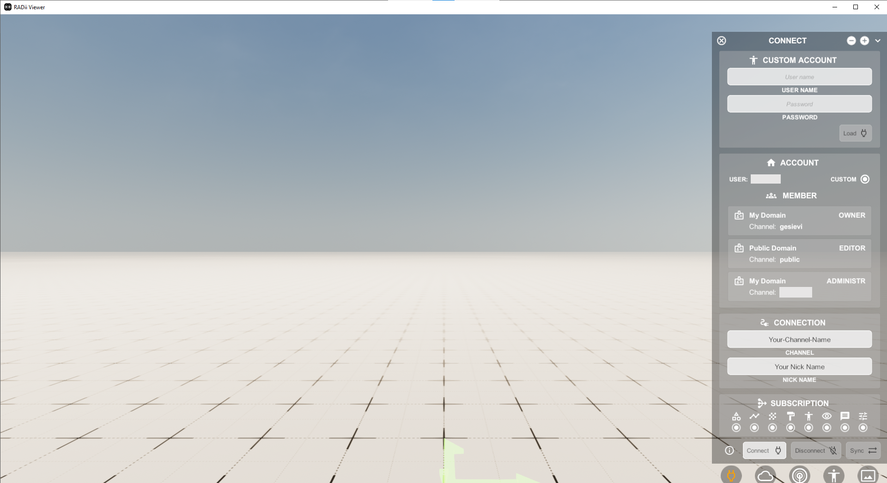

***************************************
Setup RADii Standard Viewers (Win/Mac)
***************************************

.. image:: ../Setup/Images/Radii_Info_Downloads_Standard_viewer.png

1. **Download** the latest Radii Viewer for your platform from https://RADii.info/
2. **Register** in the user panel **and confirm** your email (it is not necessary to set a domain name)
3. **Install** the file
4. **Start** RADii Viewer

    

    

**Congratulations** you have installed Radii. On how to use Radii consult the Quick Guide and the Viewer documentation

Technical Information
**************************************************************************

While the Radii Viewer can run on relatively simple machines, the resources necessary scale with the complexity of the model and the level of its optimisation.
As a live renderer the Radii Viewer needs more computing power than the CAD Software (Rhino). A model that is almost to complex in Rhino, will not run on a device in the Viewer.
For very big models it can be necessary to run the Rhino Editor on a different device than the viewer.

For 32bit system there is a limit of 2GB for each component and saves.

.. topic:: Radii PC requirements:
  
  - ideally min. 4 GB of RAM but also works with 2 GB for small projects
  - a graphics card of medium strength or higher
  - Rhino 3D license to use Grasshopper (only necessary for the Plugin)

.. tip::

  In the cases of very big models it is the best practice to save them to the cloud before a presentation and then commanding a load to the viewers through the `Publish Reference`_ component.
