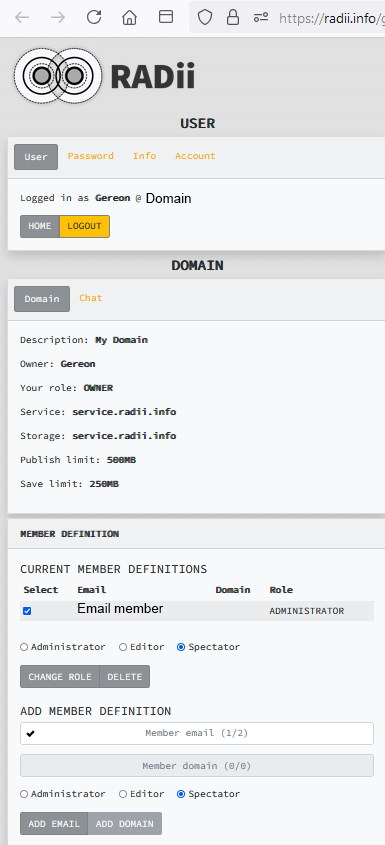

********************************
Setup RADii.info
********************************

By registering at `RADii.info`_ you get aces to your own channel on the Radii server.
It shows you where your storage is and what your publish and save limits are. In this example they are 500 mb and 250 mb respectively.

``Channel:`` lets you switch between the subfolders of the channel and previews them. 

If you would like to have a specific domain, your own server, unlimited or local storage contact RADii at **contact@RADii.info**.

Member Definition
*********************

The owner can define a number of roles for members that have been added to a channel. via the Add member section.

| Administrators:
| Editors:
| Spectators:

Server Storage
******************
 
- **Unregistered users**:

  - publish limit : 250 mb
  - save limit    : 50 mb
  
- **Registered users**:

  - publish limit : 500 mb
  - save limit    : 250 mb 
  
- **Organizations**: Can be defined in coordination with `RADii.info`_

