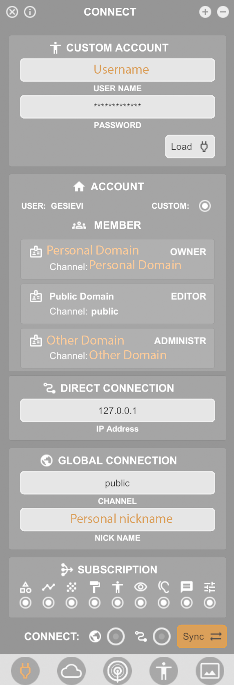

************
Connect Menu
************
.. icon Menu

.. image:: /tutorial/Radii_Icons/connect.png

.. image of Radii and the Connect Menu

This menu is for connecting to a channel, logging into your custom account, subscribing to specific types of content and for connecting to the voice chat.
Logging into your RADii account gives you access to your personal channel and potentially your group channels, with more live and permanent storage.

**1. Custom Account from Radii.info**

- the login menu can be opened by pressing the custom button in the ACCOUNT section
- gives access to your personal channel with more storage as well as all other group channels the account is associated with
   - group channels can be hosted privately and have an individually defined storage level
- Necessary if you want to edit items in cooperation with others

**2. Account**

- Lists all channels you have access to and your rights (owner/editor/administrator)
- My domain - is your personal domain that has your username as channel address
- Public Domain - everyone has access to the public channel
- Group channel - if you are associated with a group this is where 

**3. Connection**

- Channel - input the channel address,  subchannels can be accessed by adding them separated by a point. Example: channelname.subchannelname
- Nickname - displayed for others on the server

 **Note**: ``If you type in a channel name that does not exist one by that name is creates and you will be able to connect nonetheless, this means that in case of a typo you will not be notified.``

**4. Subscription**

   - The types of data you receive: geometry, lines, point-clouds, textures, other players, views, messages, settings

**5. Voice Chat**

.. table::
  :align: left

  =============================================================  ======================
  .. image:: /tutorial/Radii_Icons/Channel.png                   Join the voice chat
  .. image:: /tutorial/Radii_Icons/speaker_24_inv.png            Output
  .. image:: /tutorial/Radii_Icons/microphone_24_inv.png         Input
  .. image:: /tutorial/Radii_Icons/spatial_sound_24_inv.png      Positional sound  
  .. image:: /tutorial/Radii_Icons/debug_24_inv.png              Echo (for testing)
  =============================================================  ======================

*Output Device:* Taken from the system standard and can be changed in the settings
*Input Device:* Taken from the system standard and can be changed in the settings

**Note:** ``As of now, Positional sound and non-Positional sound work as two isolated voice chats. 
To hear each other, all parties have to be in the same state.``

**6. Server**

.. table::
  :align: left

  ====================================================  ==============================================================
  .. image:: /tutorial/Radii_Icons/Info_inv.png         I-Info menu with version number, RADii.info, Privacy Policy and Terms and Conditions
  Connect                                               Press connect after setting the channel name to join a channel
  Disconnect                                            To exit a channel
  Sync                                                  Synchronizes with a channel, to receive all content that was previously sent
  ====================================================  ==============================================================

**Video**

- `Voice chat and viewer to viewer control`_