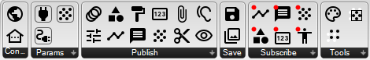

.. RevSarah

********************
RADii Grasshopper
********************

Types of components:
------------------------

| **1. Connect** is the fundamental component to connect to a channel, it is always connected to all components that are in use.
| **2. Params** relay or link the described datatype
| **3. Publish** components send different types of data from CAD software to a channel and its connected receivers.
| **4. Save** enables you to save locally to .RADii files or on a channel in the cloud.
| **5. Subscribe** imports data from a viewer back to your local Rhino Grasshopper session.
| **6. Tools** to modify point clouds and meshes 

How to Build a RADii Grasshopper file

.. image:: /tutorial/Radii_diagramms/Daten_Diagramme_v2/Artboard14.png
    :alt: Diagram of all ways in which data can be sent, stored and received with RADii

Diagram of all ways in which data can be sent, stored and received with RADii

Grasshopper Components
-----------------------

.. @gereon_: maybe we could takl about menus on rightclick of components here; maybe think about how to clearly structure
.. explanations of the different menu sections
.. @sarah reply: what do you mean with structure of the explanations ?
.. @gereon_: generally, there seem to be very different ways of using the formatting. i think it would make sense
.. to unify these; for example use the tips only if you show how something is done, use the important or warning (best decide for one of them) if you want to hint to
.. potential problems; maybe there is also some sort of formatting to use for the videos section and maybe this is always at the very bottom??
.. @sarah reply : totally agree it would propose to go with tips and important - i will do the reformating - the warning was for kind of greater important things to watch out for, i will see if 
.. the information that is in the boxes is rather on the warning side or important and will change it acordingly
.. @gereon_ the explorer on the right hand side: would make sense to have things structured better there (mit einrückung??)
.. @sarah reply : bis jetzt funktioniert das sidebar auf der rechten Seite als überblicksmenü, welches keine Hierarchie hat - wäre offen dafür das aus zu probieren habe aber keine Idee wie sonst strukturieren
.. es gibt bis jetzt nur die Überschrift ganz oben und dann die zwischenüberschriften

.. Note: the naming in toctree is case sensitive

**Connect Components**

.. toctree::
    :titlesonly:
    :numbered:
    :glob:
    
    *connect

**Publish Components**

.. toctree::
    :titlesonly:
    :numbered:
    :glob:
    
    *publish*

**Save Components**

.. toctree::
    :titlesonly:
    :numbered:
    :glob:
    
    *Save*

**Params Components**

.. toctree::
    :titlesonly:
    :numbered:
    :glob:
    
    *Params*

**Subscribe Components**

.. toctree::
    :titlesonly:
    :numbered:
    :glob:
    
    *Subscribe*

.. @gereon_ tips von menu unten rausnehmen und als eigenen punkt, formatiert in diesem kasten mit tips
.. @sarah : so ?

**Tools Components**

.. toctree::
    :titlesonly:
    :numbered:
    :glob:
    
    *Tools*

.. Tip::

    .. toctree::
        :titlesonly:
        :glob:

        *10_Tips*

  

.. @help put link for 10 tips above