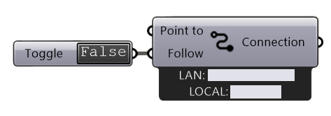

.. RevSarah

***********************
Connect Global & Local
***********************

.. image:: ../images/Connect/Connect.png
  :align: left
  :scale: 83%

.. topic:: Definition

  The connect components are the **central components** of the RADii plugin. 
  All other components are connected to one of them via the ``Connection`` output.
  Only components that are connected will be published, as soon as you switch the Toggle to "True". 
  
There are two ways to connect:
  Connect Global:
   - connects to a channel that can be accessed globally
   - works with an account from RADii.info

  Connect Local:
        - can be used offline on your device or local network
        - is quicker since there is no need for any cloud upload

.. the section below should not have a number 
.. (not 1.1. two types of connect) but belong to the general section 1. connect global and local

.. .. topic:: 1. Connect Global

  - connects to a channel that can be accessed globally
  - works with an account from RADii.info

.. .. topic:: 2. Connect Local
  
  - can be used offline on your device or local network
  - is quicker since there is not need for an upload to the cloud

Input
---------

.. table::
  :align: left

  ========    ====================================== ================
  Name            Description                            Type 
  ========    ====================================== ================
  Connect        Start the connection to the server     Boolean
  Point to       The Rhino view is sending a pointer    Boolean
  Follow         Everyone follows the Rhino view        Boolean
  ========    ====================================== ================

Output
------------

.. table::
  :align: left

  ===========  ================================================== ================
  Name            Description                                     Type
  ===========  ================================================== ================
  Connection   All further components have to be connected here   RADii components
  ===========  ================================================== ================

Connect Global:
----------------

.. image:: ../images/Connect/Connect.1.png
    :scale: 80 %

``Right click to open the menu``

.. table::
  :align: left

  ================= ====================================================
  Nickname          Name in the viewer for other users to recognize you
  Channel           Select Channel from list
  subchannel        Type subchannel name
  Username          `RADii.info`_ username
  Password          `RADii.info`_ password
  Load account      Load Radii.info account
  Create an account Forwards you to the `RADii.info`_ website
  ================= ====================================================

.. note:: 

  If you are part of a group or organization, please use the respective email address to log in

About channels, subchannels and subsubsubchannels:
"""""""""""""""""""""""""""""""""""""""""""""""""""

.. image:: /tutorial/Quick_Guide//1_LV_Explo_Images/Grashopper/03_Quick_Guide_Publisher_zugeschnitten.png

In RADii grasshopper connect_ the same address can be reached by: logging in, choosing "channelname > My Domain" and then under "-subchannel-" 
typing the respective subchannel or subsubchannel as shown in the image below.

The way to note a channel addresses in the Viewers `Connect Menu`_ is channelname.subchannel.subsubchannel. and can be endlessly extended in this way. 

.. tip::
    
  **How the channel** ``sun.hs23.g1`` **is written:**

  In the RADii viewer:
  ``sun.hs23.g1``

  In Grasshopper `Connect`_ 
  select from the available Channels:

  ``Sun > My Domain`` and 
  type: ``subchannel:*hs23.g1``

Connect Local:
--------------------------------

When using Connect Local, all content is automatically sent to all open instances of the RADii Viewer on the same device as long as the Viewers ``Local Connection`` Ip Address is set to the ``Local`` IP-Adress
that is displayed below the component.

To connect locally to another editor in the same network, input the ``LAN``: Ip Address below
the component into the Viewers ``Local Connection`` Ip Address

.. image:: ../images/Connect/Connect_local_viewer_noIP.png
  :scale: 90%

.. important:: 

  For local connection to work, the devices have to be in the same network.

Videos:
---------

`Connect - Follow video Demo <https://www.youtube.com/watch?v=h-5thZiZg1Q>`_
