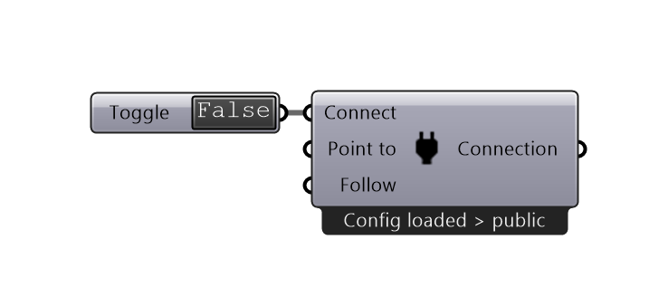
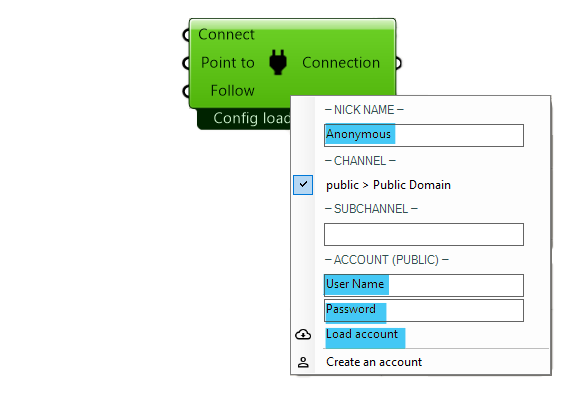

************
Connect
************

The connect component is the **central component** of the RADii plugin. All other components are connected to it via the "Connection" output.
Only components that are connected will be published, as soon as you switch the Toggle to "True".
With it, you can select the channel you want to publish to, and log into your RADii account.

**Input**

========    ====================================== ================
Name            Description                            Type 
========    ====================================== ================
Connect        Start the connection to the server     Boolean
Point to       The Rhino view is sending a pointer    Boolean
Follow         Everyone follows the Rhino view        Boolean
========    ====================================== ================

    `Follow video Demo <https://www.youtube.com/watch?v=h-5thZiZg1Q>`_

**Output**

===========  ================================================== ================
Name            Description                                     Type
===========  ================================================== ================
Connection   All further components have to be connected here   RADii components
===========  ================================================== ================

**Right click menu:**

.. image:: ../images/Connect/Connect.1.png

- Give yourself a *nickname* (this will be your name in the viewer so other users can recognise you)
- input your:
    - User Name
    - Password
- click on "load account"
- if you do not have an account, create one on `RADii.info`_

Note: If you are part of a group or organization, please use the respective email address.

**About channels and subchannels and subsubsubchannels:**
The way to write channel addresses in the viewer is channelname.subchannel.sub.sub and can be endlessly extended. 
In RADii grasshopper the same address is reached by logging in, choosing "channelname > My Domain" and then under "-subchannel-" 
typing subchannel.sub.sub 

.. image:: /tutorial/Quick_Guide//1_LV_Explo_Images/Grashopper/03_Quick_Guide_Publisher_zugeschnitten.png

Example:
The channelname "sun" in grasshopper:
-channel-
Sun > My Domain

-subchannel-
hs23.g1

In the RADii viewer:
-channel-
sun.hs23.g1 

