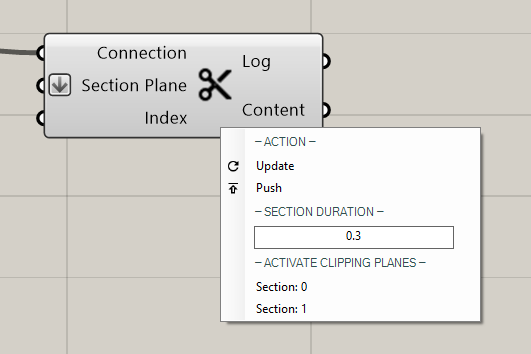

****************
PublishSection
****************

This component is used to publish clipping planes from Rhino or directly from grashopper to a channel.

Video tutorials:

- `Publish Section city scale <https://www.youtube.com/watch?v=5zsiGtmGIz4>`_
- `Publish Section building scale <https://www.youtube.com/watch?v=3mJXLDXxK8o>`_
- `Section Pointcloud <https://www.youtube.com/watch?v=JkuKp_Q2p2A>`_

**Input**

==========  ======================================  ==============
Name        Description                             Type
==========  ======================================  ==============
Connection  Link with the Connect component         Connection
Section     Plane A plane that will cut the model   Plane/surfaces
Index       Select a plane from a list              Number
==========  ======================================  ==============

    - you can connect a number slider with "index" if you have connected a list of surfaces with the input: "Section Plane"
    - Rhino clipping planes are automatically imported and have to be selected in the menu below -Activate clipping planes-

**Output**

==========  ======================================  ==============
Name        Description                             Type
==========  ======================================  ==============
Log         Documents changes & Data send           Text
Content     Connect to Content                      Radii content
==========  ======================================  ==============

**Menu**

==========================  ================================================
Section Duration:           how quickly the section is moving into place
Set duration:               toggle to have a moving clipping plane
Activate clipping planes:   clipping planes from rhino to be selected
==========================  ================================================

**Note:** 

- In Rhino flipping a clipping plane is not recognized by Radii, rotating the plane by 180° however achieves the same
- Names of clipping planes are not carried over into the Grasshopper plugin at the time of writing