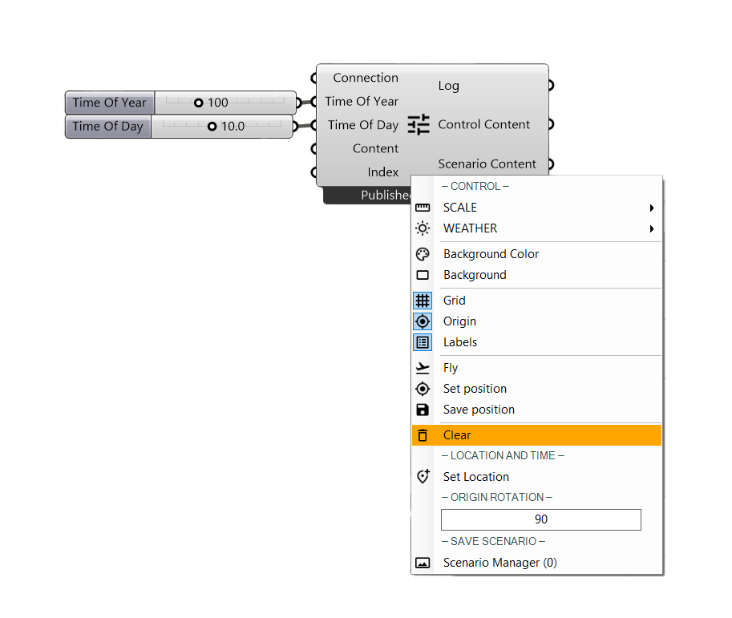

****************
PublishControl
****************

Publish control directs the viewer settings from grasshopper as listed in the menu section below.
It contains the Scenario Manager that can save setting and all other content into a scenario to be played at once. With scenarios it is possible to do more complex presentations.
 
 - Be careful with saving geometry content into this component, this can make your grasshopper file very heavy. 
   
  Tip: Grasshopper has an autosave. If the Publish Control component becomes too heavy, it will make you wait a lot

**Video tutorials:**

- `Publish Control overview <https://www.youtube.com/watch?v=-_7DvX_-9uY>`_
- `Publish Control cloud load <https://www.youtube.com/watch?v=9upFjrH9zrE>`_

**Input**

=============   ======================================      ==============
Name            Description                                 Type
=============   ======================================      ==============
Connection      Link with the Connect component             Connect
Time of Year    Day of the Year                             Number
Time of Day     Time of the day                             Number
Content Save    output from other radii components          save (Radii)
Index           For switching between scenarios             Number
=============   ======================================      ==============

**Output**

=============  ======================================      ==============
Name           Description                                 Type
=============  ======================================      ==============
Log            Documents changes & Data send               Text
Save Control   Saving the controls only                    Radii
Save Scenario  Save control and geometry                   Radii
=============  ======================================      ==============

**Menu**

=================== ============================================================================================
Name                Description
=================== ============================================================================================
Scale               Set the model scale
Weather             Weather options
Background color    Set the background color
Background          Toggle the background color
Grid                Toggle base floor
Origin              Toggle origin sign
Labels              Toggle all labels
Fly                 Forces viewers to fly
Set position        Set the camera of your active rhino viewport as position
Save position       Include the position in a scenario save
Clear               Clears all content from viewers
Set Location        Sets the world location for the sun
Origin rotation     Rotates the model by x-degrees
Set origin rotation Confirm rotation
=================== ============================================================================================

**Tips**

- The saved content is stored in the component, be aware that huge amounts of geometry can make your .gh file very heavy and slow
  - In this case turn off the grasshopper autosave setting as it will slow you down  
- To save time with heavier and bigger models: with `Publish Reference`_ you can direct all viewers to download a saved file from a channel, instead of live uploading and then downloading to the viewers.  

**Scenario Manager**
-----------------------

.. image:: ../images/Publish/Publish__controll_manager.png
    :scale: 80 %

The scenario manager saves the selected options of the publishControl component and content that is connected to it into scenarios that can be played in succession. 

==============  ============================================================================================================================
Scenario Name   The name you want to give your scenario
Save            Save the scenario, can be used to save on top of existing scenrios  
Update          Updates time set and settings that can be set in publish control but not geometry
Rename  	      Renames a scenario
Clear           clears the scene before a scenario
Duration        length of the scenario
==============  ============================================================================================================================

**Column descriptions**

==========  ==============================================================================================
Blank       Number of the scenario
Scenario    name of the scenario
Content     is content send (geometry, views, etc.) you could just send settings (time, position etc.)
Clear       Clears the channel before uploading new geometry
Load        loading from the channel
Duration    of the scenario when played on auto play in the viewer
==========  ==============================================================================================

**Examples**

You have some geometry (a building) and want to publish or download from the server (1), then walk through it, change the time of the day (2) and
continue your tour via a series of pre defined views (3-4).
Instead of setting everything live during your presentation, you define one position after the other and save
them as individual scenarios. You then can switch through them during your presentation more easily.

**1)**

.. image:: ../images/Publish/Scenario_Manager_examples/1.png

**2)**

.. image:: ../images/Publish/Scenario_Manager_examples/2.png

**3-4)**

.. image:: ../images/Publish/Scenario_Manager_examples/3.png

.. image:: ../images/Publish/Scenario_Manager_examples/4.png  