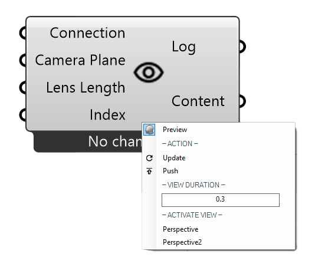

************
PublishView
************

This component is used to publish saved views to all user of a channel. All present Viewers will be moved to the selected view.

- there are two ways to import views:
  
  - grasshopper via the component input
  - Saved Rhino views are accessible in the component menu

**Input**

=============   ======================================  ==============
Name            Description                             Type
=============   ======================================  ==============
Connection      Link with the Connect component         Connect
Camera Planes   Planes to define viewpoints             Plane
Field of view   Size of view                            Number
Index           To switch between views                 Number
=============   ======================================  ==============

**Output**

=======   ======================================  ==============
Name      Description                             Type
=======   ======================================  ==============
Log       Documents changes & Data send           Text
Save      Connect to SaveContent for saving       Radii content
=======   ======================================  ==============

**Menu**

=========== ======================================  
View        Duration Speed to switch between views
Active view Rhino Views
=========== ======================================

*Tip:* The camera lense length from Rhino is used for Rhino views.