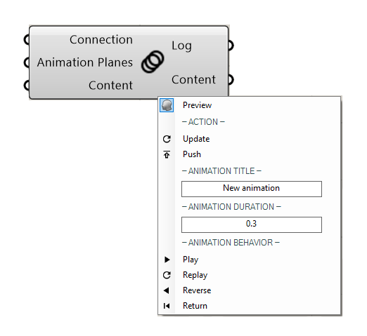

******************
PublishAnimation
******************

.. topic:: Definition
    
  This component is used to publish animations to a channel.
  If no content is given as an input, all Viewers present will be subjected to the animation, similar to a dolly camera.
  In case content is connected to the component, the animation will be applied to the geometry. 
  At least 3 planes are necessary for an animation.

**Input**

.. table::
  :align: left
    
  =================   ========================================    =======================================
  Name                Description                                 Type
  =================   ========================================    =======================================
  Connection          Link with the Connect component             Connect
  Animation Planes    Along the path you want to animate          Planes
  Content             Geometry you want to animate                Save of Publish Geometry component
  =================   ========================================    =======================================

**Output**

.. table::
  :align: left
    
  ==========  ======================================  ==============
  Name        Description                             Type
  ==========  ======================================  ==============
  Log         Documents changes & Data send           Text
  Content     Connect to Content                      RADii content
  ==========  ======================================  ==============

**Menu**

.. table::
  :align: left
    
  ==========  ==========================================
  Animation   Title / Name of your Animation
  Animation   Duration Speed: higher number = quicker
  Animation   Behavior Play, Replay, Reverse, Return
  ==========  ==========================================

.. tip:: 
  **Multiple Animations in parallel:**

  To play multiple animations in parallel with one component, use the following setup:

  .. image:: ../images/Publish/Publish_animation_parallel_schaltplan.png

**Videos**

- `Object Animation example <https://www.youtube.com/watch?v=yMZXNn_Pgq4>`_
- `Animation example <https://www.youtube.com/shorts/9h1RwmqvWDQ>`_
- `Object animation <https://www.youtube.com/watch?v=yMZXNn_Pgq4>`_
