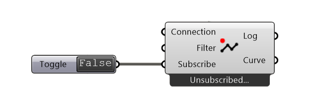

****************
SubscribeCurve
****************

This component is used to subscribe to lines that are published to a channel.

**Input**

==========  ======================================  ==============
Name        Description                             Type
==========  ======================================  ==============
Connection  Link with the Connect component         Connection
Filter      Filter own publication/broadcast        Boolean
Subscribe   Toggle the subscription                 Boolean
==========  ======================================  ==============

**Output**

==========  ======================================  ==============
Name        Description                             Type
==========  ======================================  ==============
Log         Documents changes & Data send           Text
Curve       Element to work with                    Curve
==========  ======================================  ==============

