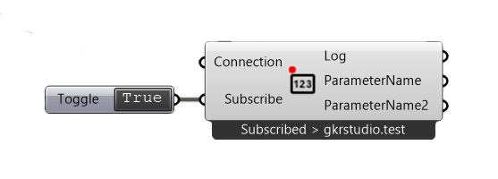
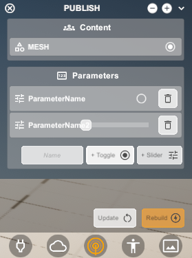

*******************
SubscribeParameter
*******************

**Grasshopper component**

**Radii viewer counterpart**

This component is used to subscribe to a parameter that is set in a Radii Viewer or by `Publish Parameter`_ , it can then be changed in the Viewer and fed back into the grashopper session with this component.

Example: Values from SubscribeParameter could be used to modify geometry in a grasshopper algorithm.

**Input**

==========  ======================================  ==============
Name        Description                             Type
==========  ======================================  ==============
Connection  Link with the Connect component         Connection
Subscribe   Toggle the subscription                 Boolean
==========  ======================================  ==============

**Output**

==================  ======================================  ==============
Name                Description                             Type
==================  ======================================  ==============
Log                 Documents changes & Data send           Text
Parameter/Boolean   Parameter/Boolean from Radii Viewer     Boolean/Number
==================  ======================================  ==============

  - The more parameters you define in the viewer the more will be on this component
  - the number will be between 0 to 1, you can remap this to any other range

