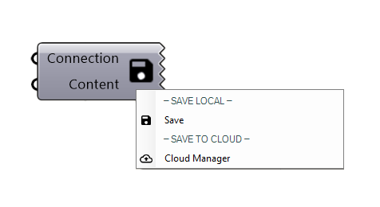
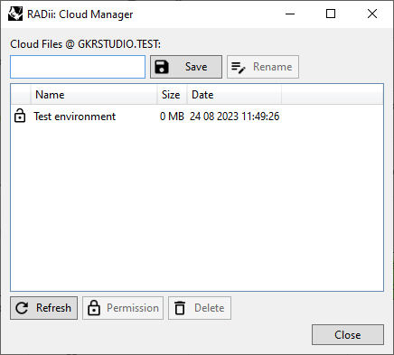

************
SaveContent
************

.. topic:: Definition
  
  This component is used to save content locally or to a channel in the cloud.

**Input**

.. table::
  :align: left

  ==========  ======================================  ==============
  Name        Description                             Type
  ==========  ======================================  ==============
  Connection  Link with the Connect component         Connection  
  Content     To be included in the save              RADii content
  ==========  ======================================  ==============

**Menu**

.. table::
  :align: left
    
  ==============  ==========================================
  Save            Save a RADii file locally
  Cloud Manager   Save to the connected channel
  ==============  ==========================================

.. tip::

  - Cloud content can be loaded via the scenario manager
