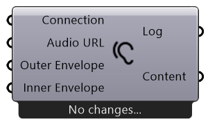
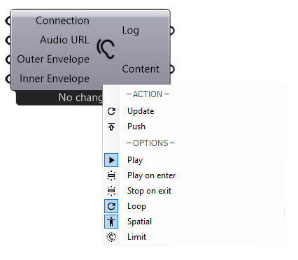

***************
Publish Sound
***************

Sound is emitted by a source in the center of the inner and outer envelope, it decreases over distance unless "stop on exit" or "limit" is set.

**Videos:**

        - `Publish sound basic usage <https://www.youtube.com/watch?v=4iT8-PehmJE>`_
        - `RADii: Sound development <https://www.youtube.com/watch?v=0mPwLp1ye34>`_

**Input**

================  ======================================  ==============
Name                Description                             Type
================  ======================================  ==============
Connection          Link with the Connect component         Connection
Audio URL           The URL of the audio file               Note - Multiline Data
Outer Envelope      Defining the outer sound reach          Circle
Inner Envelope      Defining the inner sound reach          Circle
================  ======================================  ==============

**Output**

==========  ======================================  ==============
Name        Description                             Type
==========  ======================================  ==============
Log         Documents changes & data send           Text
Content     Connect to Save component for saving    RADii content
==========  ======================================  ==============

**Menu**

==============  ==========================================
Name            Description
==============  ==========================================
Play            Play the sound
Play on enter   Play sound after entering outer envelope
Stop on exit    Stop sound after exiting outer envelope
Loop            Loop the sound
Spatial         Sound spacial in direction of the origin
Limit           Sound decreases to 0 at the outer envelope
==============  ==========================================