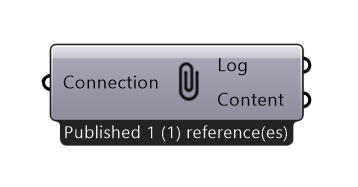
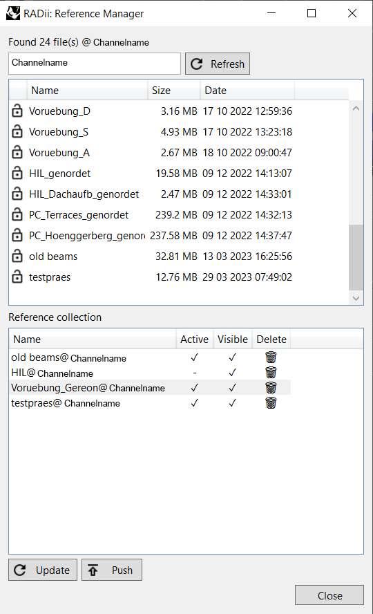

******************
PublishReference
******************

    

.. topic:: Definition
    
  The reference manager is for storing a list of references, loading and displaying them from channels.
  The component can be connected to `Publish Control`_ & `Save Content`_ to automatically load and show different configurations of references. 
  By activating (loading) geometry before a presentation, it is possible to easily and quickly switch between visible and invisible states without long loading times that can occur with bigger models.    

**Input**

.. table::
  :align: left

  ==========  ======================================  ==============
  Name        Description                             Type
  ==========  ======================================  ==============
  Connection  Link with the Connect component         Connection
  ==========  ======================================  ==============

**Output**

.. table::
  :align: left
    
  ==========  ======================================  ==============
  Name        Description                             Type
  ==========  ======================================  ==============
  Log         Documents changes & data send           Text
  Content     Connect to Save component for saving    RADii content   
  ==========  ======================================  ==============

**Menu**

.. table::
  :align: left
    
  =====================   ==========================================
  Name                    Description                           
  =====================   ==========================================
  Channelname             Channel to access references from
  Refresh                 Update List
  List                    Names of Geometry Collections on the channel
  Reference collection    For collecting references from channels
  Active                  Loads the Reference to all viewers
  Visible                 Shows the Reference to all viewers
  =====================   ==========================================