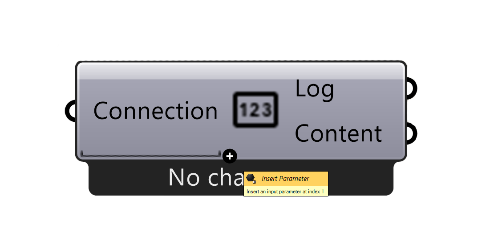
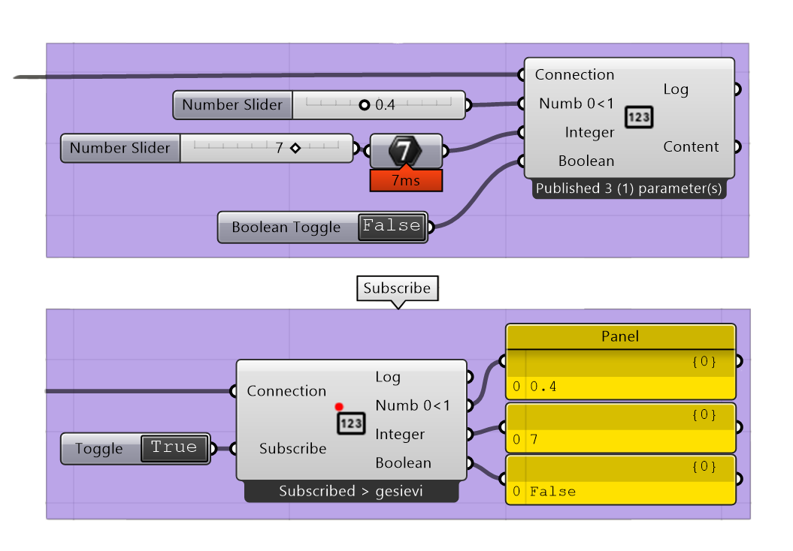

.. RevSarah

*******************
PublishParameter
*******************

.. topic:: Definition
    
  Publish Parameter publishes a set of defined booleans, integers or decimal numbers to the viewer.
  Additional parameters can be added by pressing the ``+``, that appears when zooming in very close to the component. 
  The resulting input can be renamed and connected to a number slider or boolean toggle. 
  For numbers that should be understood as integers, add an integer component between the input and the number, as shown in the image below.
 

These values can be interacted with in the Viewers and then feed back to the rhino session with the `Subscribe Parameter`_
component.
It is possible to define such parameters in a viewer, they are however temporary to every session.  

Input
---------

.. table::
  :align: left
    
  ==========  ==========================================  ==============
  Name        Description                                 Type
  ==========  ==========================================  ==============
  Connection  Link with the Connect component             Connection
  ``+``       Adds a boolean, integer or decimal number   Boolean, Integer, Decimal

  ==========  ==========================================  ==============

Output
------------

.. table::
  :align: left
    
  ==========  ======================================  ==============
  Name        Description                             Type
  ==========  ======================================  ==============
  Log         Document changes & data sent            Text
  Content     Connect to Save or use otherwise        RADii content
  Sequence    Sequence to be saved as content         Radii content
  ==========  ======================================  ==============

The image shows how numbers between 0 and 1, integers and Booleans can be added to the Publish Parameter component.
Below is the `Subscribe Parameter`_ component that receives the Parameters from the viewer, they could be changed in the viewer and would come back different in that case.
Between the viewer and the publisher, the last change will be the dominant to be received by `Subscribe Parameter`_ .

Videos:
-------------

`Introducing Publish Parameter`_

*Implemented in v.39_b*