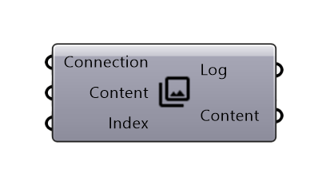
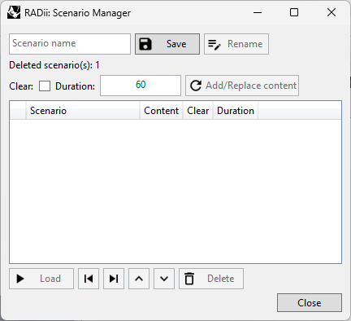

**********************
Save Scenario
**********************

.. topic:: Definition

 The `Save Scenario`_ component can collect all types of content, views, references, settings and more into scenarios, that can then be published to connected viewers instantly.
 Use scenarios to structure more complex presentations.
  
.. attention:: 

  Be careful with saving big amount of geometry content into the `Save Scenario`_ component, since this will make your Grasshopper file very heavy. Alternatively use `Save Scenario`_ to save your geometry to the cloud and use `Publish Reference`_ to integrate it to your scenarios.

.. tip:: 

  - The ``Content`` output can be saved to the cloud with `Save Content`_
  - If your Grasshopper file becomes slow due to the large amount of data in the `Save Scenario`_ component, you can deactivate the Grasshopper autosave (which is turned on by default).

Input
---------

==========  ========================================= ==============
Name        Description                               Type
==========  ========================================= ==============
Connection  Link with the Connect component           Connection
Content     Content to be bundled into one scenario   RADii content
Index       To switch between scenarios               Integer
==========  ========================================= ==============

Output
------------

==========  ======================================  ==============
Name        Description                             Type
==========  ======================================  ==============
Log         Documents changes & data send           Text
Content     Connect to a Save component             RADii content
==========  ======================================  ==============

Scenario Manager
-----------------------

=================== ============================================================================================================================
Scenario Name       The name you want to give your scenario
Save                Save the scenario, using an existing name to overwrite scenario
Rename  	          Renames a scenario
Clear               Clears the scene of all content before a scenario
Duration            Length of the scenario when played in the viewer in auto mode
Add/Replace content New content will be added and existing updated. If used with existing content that has zero elements, it will delete it from the scenario
=================== ============================================================================================================================

**Column titles**

==========  ==============================================================================================
Blank       Index of the scenario
Scenario    Name of the scenario
Content     is content sent (geometry, views, etc.) you could just send settings (time, position etc.)
Clear       Clears the channel before uploading new geometry
Load        Indicated if loading content via `Publish Reference`_ is included 
Duration    of the scenario when played on auto play in the viewer
==========  ==============================================================================================

An example on how to use the component can be found in the `Tutorial Advanced Presentation`_
