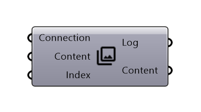
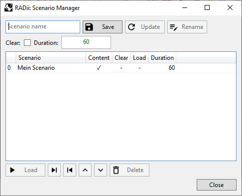
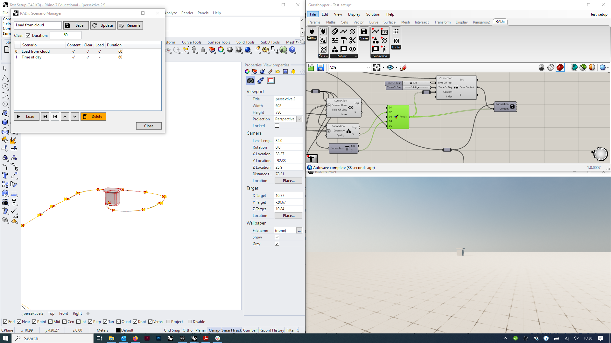
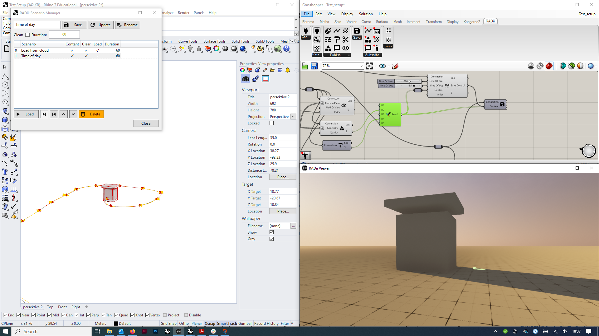
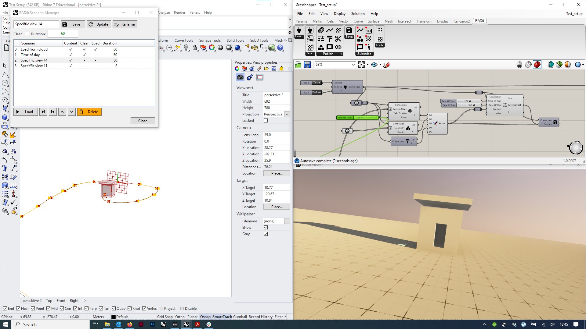
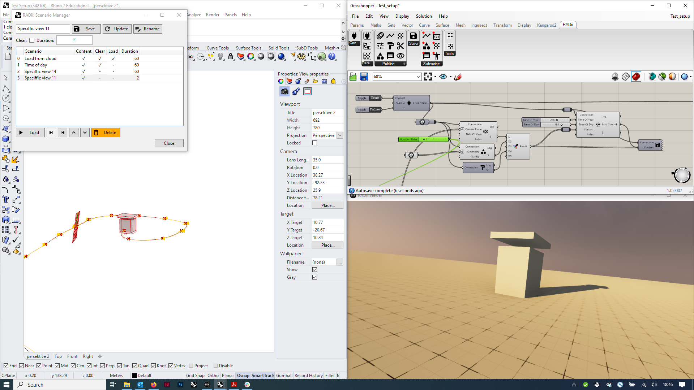

**********************
Publish Scenario
**********************

.. topic:: Definition

  The Scenario Manager can collect all type of content, views, references, settings and more into scenarios, that can then be called into a viewer at once
  With scenarios it is possible to do more complex presentations at ease.
  
.. attention:: 

  Be careful or refrain from saving geometry content into this component with scenarios, instead use `Publish Reference`_. Otherwise the Grasshopper file can get very heavy and slow.
  

.. tip:: 

  - the content from Publish Scenario can be saved to the cloud with `Save Content`_
  - Grasshoppers autosave can be deactivated, in case it takes to long 
  - To save time with heavier and bigger models: with `Publish Reference`_ you can direct all viewers to download a saved file from a channel, instead of live uploading and then downloading to the viewers.

**Input**

==========  ========================================= ==============
Name        Description                               Type
==========  ========================================= ==============
Connection  Link with the Connect component           Connection
Content     Content to be bundled into one scenario   RADii content
Index       To switch between scenarios               Integer
==========  ========================================= ==============

**Output**

==========  ======================================  ==============
Name        Description                             Type
==========  ======================================  ==============
Log         Documents changes & data send           Text
Content     Connect to Save component for saving    RADii content   
==========  ======================================  ==============

Scenario Manager
-----------------------

==============  ============================================================================================================================
Scenario Name   The name you want to give your scenario
Save            Save the scenario, can be used to save on top of existing scenrios  
Update          Updates time set and settings that can be set in publish control but not geometry
Rename  	      Renames a scenario
Clear           clears the scene before a scenario
Duration        length of the scenario when played in the viewer in auto mode
==============  ============================================================================================================================

**Column descriptions**

==========  ==============================================================================================
Blank       Index of the scenario
Scenario    Name of the scenario
Content     is content sent (geometry, views, etc.) you could just send settings (time, position etc.)
Clear       Clears the channel before uploading new geometry
Load        loading from the channel
Duration    of the scenario when played on auto play in the viewer
==========  ==============================================================================================

**Examples**

You have some geometry (a building) and want to publish or download from the server (1), then walk through it, change the time of the day (2) and
continue your tour via a series of pre defined views (3-4).
Instead of setting everything live during your presentation, you define one position after the other and save
them as individual scenarios. You then can switch through them during your presentation more easily.

**1)**

**2)**

**3-4)**

