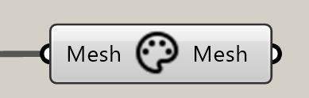

*************************
Tool Paint Vertex
*************************

.. topic:: Definition
    
  This tool bakes an image texture onto a mesh, it can then be modified without loosing the texture.
  The precision of the bake depends on the mesh resolution.

Input
---------

.. table::
  :align: left
    
  =========== ======================================  ==============
  Name        Description                             Type
  =========== ======================================  ==============
  Mesh        Mesh to paint on                        Mesh 
  =========== ======================================  ==============

Output
------------

.. table::
  :align: left
    
  ===========  ======================================  ==============
  Name         Description                              Type
  ===========  ======================================  ==============
  Mesh         with coloured vertex                    Mesh
  ===========  ======================================  ==============

Video tutorials:
-------------------

- `Paint Vertex Example <https://www.youtube.com/watch?v=PjHwRyPMDLA>`_