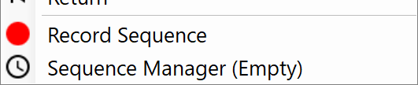

************************
Tool Sequence Recorder
************************

.. topic:: Definition

  The sequence Recorder ist an right click option in almost all publishing components that records the changes in the component inputs for a later replay. 

  Start by pressing ``Record Sequence`` in the menu and then make the changes you want to record to the  inputs. ``Stop recording``. 
  The sequence is stored in the ``sequence manager``, where the settings are located. The sequence that has an active tick in the ``output`` can be saved when connected to `Save Content`_ . 
  
  Saved sequencs can be played by loading them from the channel. They can be replayed by toggeling them in the `Users Menu`_ .

Input
-----------

==========  ========================================  ==============
Name        Description                               Type
==========  ========================================  ==============
Connection  Link with the Connect component           Connection
Anny Input  Has to go through changes to be recorded  
==========  ========================================  ==============

Output
------------

==========  ======================================  ==============
Name        Description                             Type
==========  ======================================  ==============
Sequence    To be saved with SaveContent            Radii content
==========  ======================================  ==============

Sequence Manager
-----------------

.. image:: ../images/Tools/Sequence_Manager.png

==========  ==========================================
Name        Description                            
==========  ==========================================
Output      The sequence to be saved with SaveContent component
Title       Name of the sequence
Step Time   Time of each steps in the sequence in milliseconds
Steps       Number of steps in the sequence
Duration    Total time for the sequence = steps * step time
Replay      Loops the sequence
Return      Returns the sequence to the start after replaying
Clear       Clears the sequence from viewer after a replay 
Remove      Deletes the sequence
==========  ==========================================

Examples:
----------

The building up of geometry pieces. The changing of textures as a frame by frame animation. The cycling through a big series of transfromations.

Video tutorials:
---------------------

**RADii: Sequence Recorder** 

.. youtube:: Hf-iLT7aNss
  :width: 100%
  :align: left