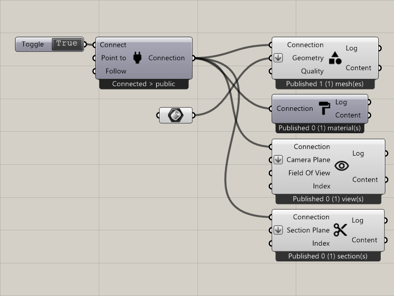

**********************************
Tutorial: Simple Presentation
**********************************

This tutorial is based on the fundamentals in the `Tutorial Grasshopper Basics`_
It explains and lists what kind of components are needed for a simple presentation in Radii. 

For such a presentation you need content, that you then can explore individually or make all other viewers follow you 
through the "follow" option of the `Connect`_ component. 
To present specific views use the `Publish View`_ component and the `Publish Section`_ for sections through the geometry.  

**Component list** to be linked to the `Connect`_ component:

- PublishGeometry_
- PublishMaterial_
- `Publish View`_
- `Publish Section`_

For more information consol the respective entries. 