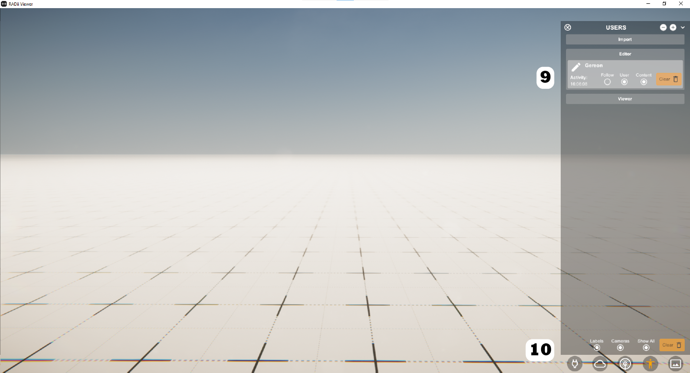
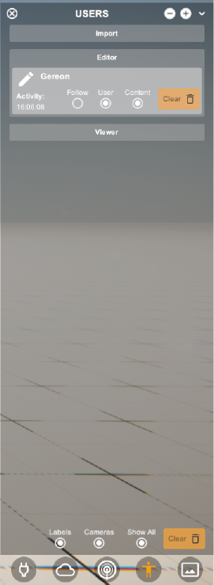

************
Users Menu
************
.. image:: /tutorial/Radii_Icons/User.png

  
**Users - List of all data in the viewer**

**Import** = data loaded from RADii file
  
- Content - toggle content
- Clear - delete content from viewer
  
**Editor** = data that was sent from RhinoGrasshopper
    
- Follow - follow the rhino view of the user
- User toggle avatar
- Content - toggle content
- Clear - delete content from viewer
  
**Viewer**  all other viewers that are on the channel

- Labels = toggles visibility 
- Cameras = toggles visibility of other user cameras 
- Show All = Toggles all user content 
- Clear = delete all content from viewer

Video tutorials:

- `Toggle content <https://www.youtube.com/watch?v=HKPb65UUk2M>`_