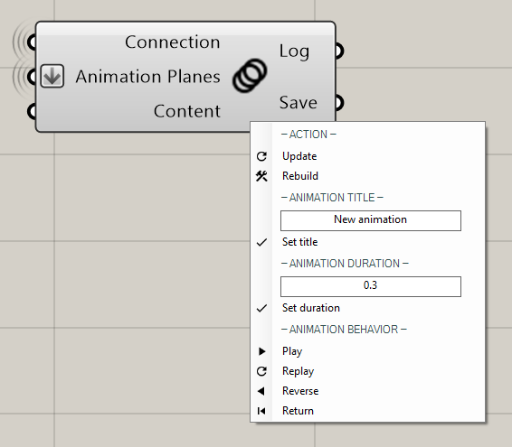
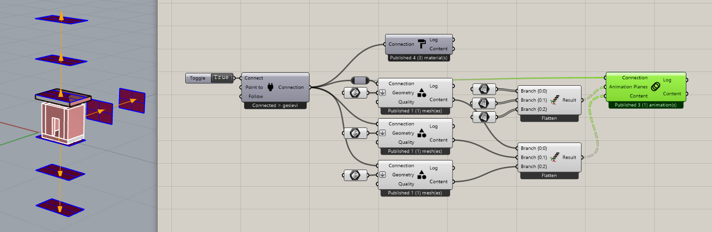

******************
PublishAnimation
******************

This component is used to publish animations to a channel.
If no content is given as an input all Viewers present will be subjected to the animation, similar to a dolly camera.
In case content is connected to the component the animation will be applied to the geometry. 
At least 3 planes are necessary for an animation.

Example: https://www.youtube.com/shorts/9h1RwmqvWDQ

**Input**

=================   ========================================    =======================================
Name                Description                                 Type
=================   ========================================    =======================================
Connection          Link with the Connect component             Connect
Animation Planes    Along the path you want to animate along    Planes
Content             Geometry you want to animate                Save of Publish Geometry component
=================   ========================================    =======================================

**Output**

==========  ======================================  ==============
Name        Description                             Type
==========  ======================================  ==============
Log         Documents changes & Data send           Text
Save        Connect to SaveContent for saving       Radii content
==========  ======================================  ==============

**Menu**

==========  ==========================================
Animation   Title Name of your Animation
Animation   Duration Speed: higher number = quicker
Animation   Behavior Play, Replay, Reverse, Return
==========  ==========================================

**Multiple Animations in parallel:**

To play multiple animation in parallel with one component use the following setup:

**Video tutorials:**

- `Object Animation example <https://www.youtube.com/watch?v=yMZXNn_Pgq4>`_
