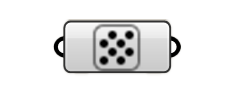

**************************
Params Pointcloud
**************************

This component converts mesh to a pointcloud or can be used to import Pointclouds from Rhino efficiently.

The pointcloud generation works by taking each mesh vertex as a point, the finer your mesh the more detail your cloud will have.
If your mesh is coloured with the color mesh component, the colors will be transferred to the pointcloud.

**Input**

=========== ============================================    ==============
Name        Description                                     Type
=========== ============================================    ==============
Right click Link Pointcloud from Rhino Scene                Pointcloud
Mesh        Mesh vertices will be turned into pointcloud    Mesh  
=========== ============================================    ==============

**Output**

==========  ======================================  ==============
Name        Description                             Type
==========  ======================================  ==============
Pointcloud  Generated or Linked Pointcloud          Pointcloud
==========  ======================================  ==============

